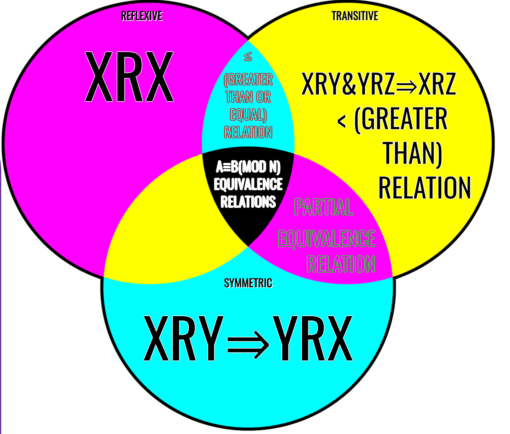

# Blog Entry #6

## Comparing Discrete Mathematics Relations: Symmetric, Reflexive, and Transitive

### Defining the Relations

Reflexitivity, Symmetry, and Transitivity are all types of Relations in Discrete mathematics. Relations are crucial in mathematics because they help define relationships between objects of the same sets or even objects in different sets and different sets entirely.

**Symmetric Relation**

In just basic mathematics, symmetry is defined as, for real numbers x and y,
```
if x = y, then y = x
```
In discrete math, the idea remains the same, but the syntax varies. In discrete, the symmetric relation is represented as
```
Assuming R⊆ AxA,
xRy --> yRx
for all x,y ∈A
```
For those of us who better understand English than discrete, this is saying that, Assuming R is a subset of the set AxA, xRy is the same as yRx for every x and y in the set of A.

**Reflexive Relation**

In basic mathematics, reflexivity is defined as, for all real numbers *x*
```
x = x
```
However, in discrete, this is also slightly different while still following the same premise. In discrete notation, reflexivitivy is denoted as
```
Assuming R⊆ AxA,
xRx
for all x∈A
```
Once again, in English this means that assuming R is a subset of the set AxA, whatever is on the left side of the R must also be on the right side and visa versa for every x in the set of A. Personally, how I remember this is reflexive sounds like reflection so I imagine that whatever is one one side must be reflected over to the other side. 

**Transitive Relation**

The transitive property states that for all real numbers *x, y* and *z*,
```
if x = y and y = z, then x = z
```
or basically if x and y are the same number and y and z are the same number, x and z must be the same number.

In discrete notation, this is very similar. Discrete notation states that 
```
Assuming R⊆ AxA,
xRy & yRz --> xRz
for all x,y,z ∈ A
```
In English this means that assuming R is a subset in the set of AxA, the combination of xRy plus yRz is the same thing as xRz if *x y* and *z* are all in the set of A.

### Relations of the Relations
The Venn Diagram below outlines the defination of the relations as well as how they relate to each other 



**Example Question**

Determine whether the relation R on the set of all integers is reflexive, symmetric, and/or transitive, where 
```
(x, y) ∈ R if and only if x != to y
```

***The symbol != means not equal for this example***

It is not reflexive because, if you plug in any number, x can not be equal to y.
It is also not symmetric because x can not equal y and y can not equal x
Lastly, it is not transitive because while x does not have to be equal to y and y does not have to be equal to z, x has to be equal to z, which is not possible. 
To make this example work for all of the relations above, x would have to be equal to y.
See below for an explaination with numbers
```
Not Reflexive - 
3 != 3
Reflexive - 
3 = 3
Not Symmetric - 
2 != 2 & 2 != 2
Symmetric - 
2 = 2 & 2 = 2
Not Transitive - 
2 != 3 & 4 != 2 so 2 != 2
Transitive
2 = 3 & 4 = 2 so 2 = 2
```


