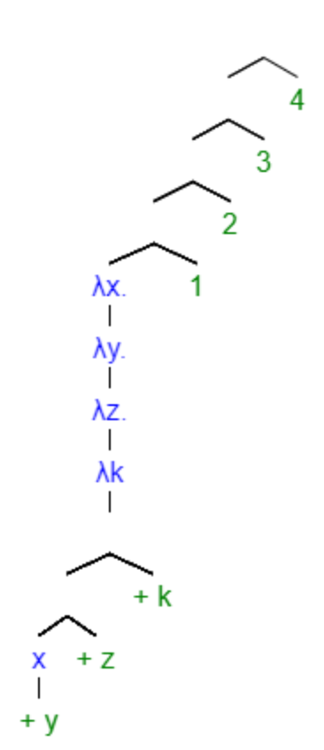

# Blog Entry #8

## Parsing Lambda Calculus

### Background of Lambda Calculus
Lambda calculus was created in the 1930's by Alonzo Church in order to study what functions were computable. Today, it is one of the simpliest programming languages but just as powerful as many modern day programming languages such as Java. In lambda calculus, programs are called lambda expressions (shortened to λexp). There are only three types of these programs in lambda calculus:

- **Abstraction**
If *e* is an expression containing *x*, it is written as *λx.e* because the program does not depend on *x* anymore and it is abstracted away. An abstraction means that it can be made into a function

- **Application**
In application, if there are two expressions, *e1* and *e2*, it is written as *e1e2* where the expression *e1* is applied to the arguemnt *e2*. The application should be as short and concise as possible

- **Variable** - the basic programs. Typically a single letter such as *x* or *y*

In general, lambda calculus is easy to add new primative and features to

### Syntax of Lambda Calculus
Before we can begin parsing lambda expressions, we must be able to simplify the syntax until it is a lambda program!
If we start with the expression **int plusOne(int n){return n+1}plusOne(2)**, we can simplify it down to a lambda program

- First we can start by removing any type declarations and parentheses
**plusOne n x n+1 plusOne 2**

- change out the function name with λ to indicate a nameless function
**(λ n x n+1) 2

Once we have the expression into a lambda expression, we can now reduce or parse the expression!

### Parsing Lambda Expressions
Given the expression

**λx. λy. λz. λk x + y + z + k 1 2 3 4**

- First figure out where the parentheses belong using the ABC = (AB)C rule. This means, figure out where the expression splits and continuously split it from there. This means that the expression becomes 

**(((((λx. (λy. (λz. (λk (((x + y) + z) + k)))))1) 2) 3) 4)**

where A = λx. λy. λz. λk, B = x + y + z + k, and C = 1 + 2 + 3 + 4.

Once we have the parentheses in the correct spots, we can parse the expression using a parcing tree!

**(((((λx. (λy. (λz. (λk (((x + y) + z) + k)))))1) 2) 3) 4)**

- First identify where the expression is split. In this case it is split between B and C. That becomes the first branch in the tree. From there, you continue splitting the expression into branches until you reach the final result below. 

